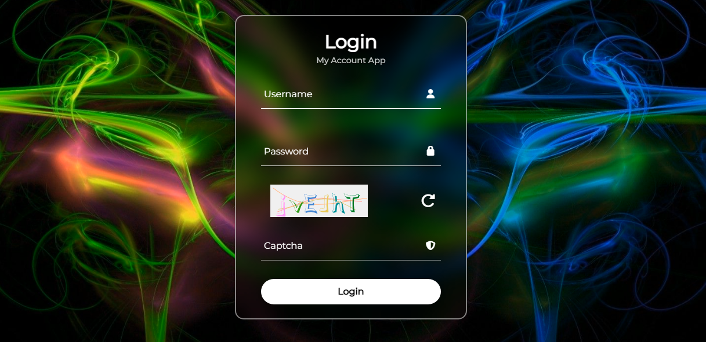
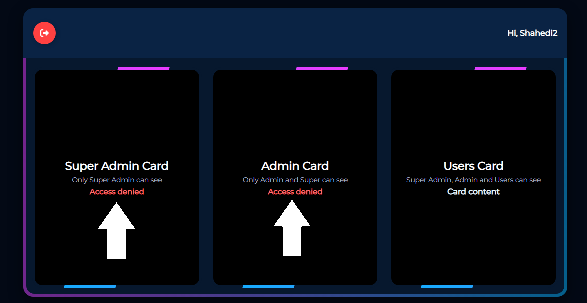
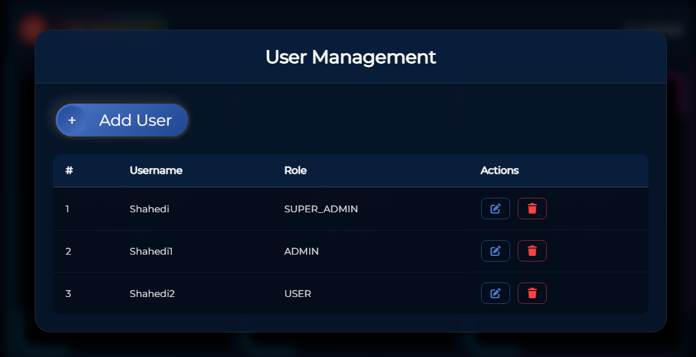
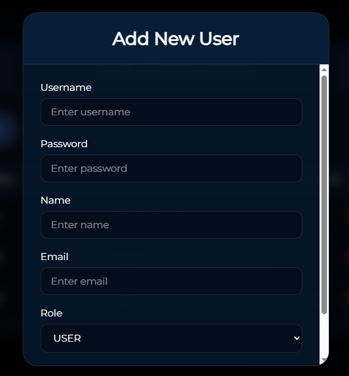
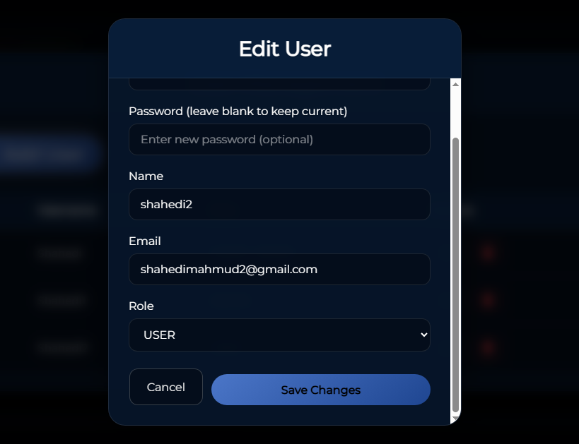
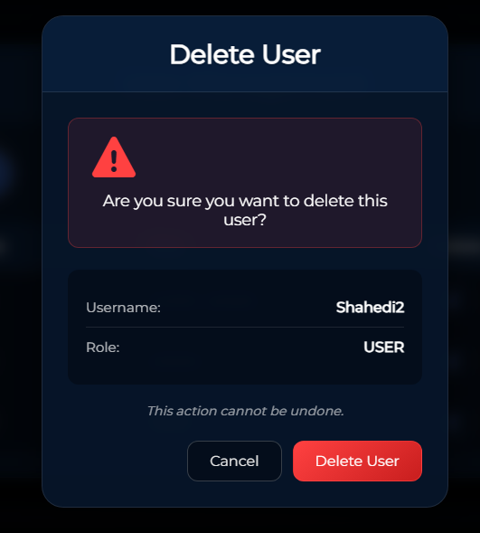

# My Account Application - Full Stack Project

A modern, user-centered full-stack application built with **React**, **NestJS**, and **MongoDB**, containerized using Docker. This open-source project demonstrates a complete full-stack architecture with role-based access control (RBAC), secure authentication with captcha, and proper service separation for enhanced security.



## 🚀 Technology Stack

### Frontend
- **React** - Modern UI library for building interactive user interfaces
- **React Scripts** - Build tooling and development server
- **CSS3** - Multiple styling approaches included for flexible development

### Backend
- **NestJS** - Progressive Node.js framework built with TypeScript
- **TypeScript** - Type-safe JavaScript for robust backend development
- **Express** - HTTP server (via NestJS platform)

### Database
- **MongoDB** - NoSQL document database
- **Mongoose** - MongoDB object modeling

### DevOps
- **Docker** & **Docker Compose** - Containerization and orchestration

## 🏗️ Architecture

This application is built using a microservices architecture with three separate Docker containers:

1. **React Container** (`frontend`) - Frontend application
   - Exposed on port `3000` for external access
   - Connected to internal Docker network
   - Only public-facing service

2. **NestJS Container** (`nest`) - Backend API
   - Runs on internal Docker network only (not exposed externally)
   - Communicates with MongoDB via internal network
   - Handles authentication, authorization, and business logic

3. **MongoDB Container** (`mongo`) - Database
   - Runs on internal Docker network only (not exposed externally)
   - Ensures maximum security by isolating the database
   - Stores user data, roles, and application state

### Security Features
- **Network Isolation** - Only the React frontend is exposed externally (port 3000)
- **Internal Communication** - Backend and MongoDB communicate exclusively through Docker's internal network
- **No External Database Exposure** - MongoDB is completely isolated from external access
- **Captcha Protection** - Server-side captcha validation prevents automated login attempts

## ✨ Key Features

### 🔐 Authentication & Security
- **Secure Login** - Requires username, password, and captcha verification
- **Session Management** - Token-based authentication with secure session handling
- **Captcha Protection** - Server-side implemented captcha to prevent brute-force attacks


### 👥 Role-Based Access Control (RBAC)
The application implements three distinct user roles with different access levels:

- **Super Admin** 🔴 - Full system access with user management capabilities
  - Complete access to all features and cards
  - User Management modal with full CRUD operations
  - Can add, edit, delete users and assign roles

- **Admin** 🟡 - Elevated access with administrative privileges
  - Access to administrative cards and features
  - Limited user management capabilities
  - Enhanced functionality compared to regular users

- **User** 🟢 - Regular user with standard access
  - Limited cards and features
  - Basic functionality access
  - No administrative capabilities

### 🚫 Access Control
Unauthorized attempts to access protected resources or endpoints will display an **Access Denied** screen, ensuring proper security boundaries are maintained.



### 👤 User Management (Super Admin Only)

When logged in as **Super Admin**, a **User Management** button appears on the dashboard. This powerful feature allows comprehensive user administration through an intuitive modal interface.



#### User Management Features:

1. **View Users** 📋
   - Display complete list of all registered users
   - View user details including name, email, role, and status
   - Real-time user list updates

2. **Add New Users** ➕
   - Create new user accounts with required information
   - Assign roles during user creation (Super Admin, Admin, User)
   - Set initial status and permissions



3. **Edit Users** ✏️
   - Modify user information including:
     - Name and email
     - Role assignment
     - Account status
   - Update user permissions and access levels



4. **Delete Users** 🗑️
   - Remove users from the system
   - Confirmation prompt before deletion
   - Safe user removal with proper validation



> All user management operations are backed by ready-to-use NestJS REST APIs. The frontend communicates with these endpoints through the internal Docker network, ensuring secure and efficient data operations.

### 🎨 UI/UX Features
- **Responsive Design** - Fully responsive across three screen sizes (mobile, tablet, desktop)
- **Multiple Style Variants** - Various button and card styles included for teaching and customization purposes
- **Role-Based UI** - Different card sets displayed based on authenticated user role
- **Modern Interface** - Clean, intuitive design with smooth user experience

## 📦 Installation & Setup

### Prerequisites
- **Docker** (Engine) installed
- **Docker Compose** (v1 or v2)
- **Git** (to clone the repository)

### Getting Started

1. **Clone the repository**
   ```bash
   git clone https://github.com/mahmudshahedi/fullstack-MyAccount
   cd fullstack-MyAccount
   ```

2. **Build and start all containers**
   
   Navigate to the root directory of the project and run:
   ```bash
   # Using Docker Compose V2:
   docker compose up -d --build

   # OR, if you use the older docker-compose binary:
   docker-compose up -d --build
   ```

   This command will:
   - Build the React frontend container
   - Build the NestJS backend container
   - Pull and start the MongoDB container
   - Create the internal Docker network
   - Establish secure connections between all services

3. **Access the application**
   
   After containers start successfully, open your browser and navigate to:
   ```
   http://localhost:3000
   ```

   The application will be running on port **3000**, and you can start using it immediately!

### Initial Demo/Test Users

The application comes with pre-seeded test users for immediate testing:

| Username | Password | Role         |
|----------|:--------:|:-------------|
| Shahedi  | 123      | Super Admin  |
| Shahedi1 | 123      | Admin        |
| Shahedi2 | 123      | User         |

> Use these credentials to test different role-based features immediately after starting the application.

## 🛠️ Development

This project is **open-source** and **extensible**. You can:

- Modify frontend components in `frontend/src/`
- Update backend services in `backend/src/`
- Extend the MongoDB schema as needed
- Add new features and functionality
- Customize styling and UI components

All containers are configured with volume mounts for hot-reloading during development.

### Docker Compose Commands

```bash
# Build and start (detached mode)
docker compose up -d --build

# Show running containers
docker ps

# Check logs for a specific service
docker compose logs -f nest      # Backend logs
docker compose logs -f frontend  # Frontend logs
docker compose logs -f mongo     # Database logs

# Stop all containers
docker compose down

# Stop and remove volumes
docker compose down -v
```

## 📱 Usage Guide

### Login Process
1. Navigate to `http://localhost:3000`
2. Enter your **username** and **password**
3. Complete the **captcha** verification
4. Click login to authenticate

### Dashboard Navigation
- After successful login, you'll be redirected to the **My Account** dashboard
- Content displayed depends on your user role:
  - **Super Admin**: Full dashboard with User Management button
  - **Admin**: Administrative dashboard with elevated features
  - **User**: Standard dashboard with basic features

### User Management (Super Admin)
1. Click the **User Management** button on the dashboard
2. The modal opens with a list of all users
3. Use the interface to:
   - **Add** new users with role assignment
   - **Edit** existing user information
   - **Delete** users with confirmation
   - **View** all user details

### Access Control
- Attempting to access protected resources without proper permissions will show an **Access Denied** screen
- Each role has specific access boundaries enforced at both frontend and backend levels

## 🔌 API Endpoints (High-Level)

The NestJS backend includes comprehensive REST endpoints:

### Authentication
- `POST /auth/login` - Login with username, password, and captcha payload
- `POST /auth/logout` - Invalidate token/session

### User Management
- `GET /users` - List all users (protected: Super Admin/Admin)
- `GET /users/:id` - Get specific user details
- `POST /users` - Create new user (Super Admin only)
- `PUT /users/:id` - Update user information (Super Admin only)
- `DELETE /users/:id` - Delete user (Super Admin only)

### Additional Endpoints
- Plus other domain endpoints used to populate role-based cards and features

> Consult the backend `README` or `OpenAPI`/Swagger documentation in the `backend/` folder for detailed payloads, response schemas, and authentication requirements.

## 📸 Screenshots & Visual Guide

### 1. Login Page
Secure login interface with username, password, and captcha verification.


### 2. Access Denied
Security screen displayed when unauthorized access is attempted.


### 3. User Management Modal
Complete user management interface for Super Admin users.


### 4. Add User Feature
Interface for creating new users with role assignment.


### 5. Edit User Feature
Interface for modifying existing user information.


### 6. Delete User Feature
User deletion interface with confirmation prompt.


## 🤝 Contributing

This is an open-source project. Contributions, issues, and feature requests are welcome!

### Suggested Workflow
1. Fork the repository
2. Create a feature branch: `git checkout -b feature/your-feature`
3. Add tests and documentation for your changes
4. Commit your changes: `git commit -m 'Add some feature'`
5. Push to the branch: `git push origin feature/your-feature`
6. Open a pull request with a clear description

## 📄 License

This project is open-source and available for modification and distribution.

## 📺 Demo & Tutorial

For a comprehensive video tutorial and walkthrough of the application, visit:

**🎥 YouTube Channel**: https://youtu.be/cp0jD2RW8to  
**🔗 LinkedIn**: https://www.linkedin.com/in/mahmud-shahedi/

---

**Built with ❤️ using React, NestJS, and MongoDB**
